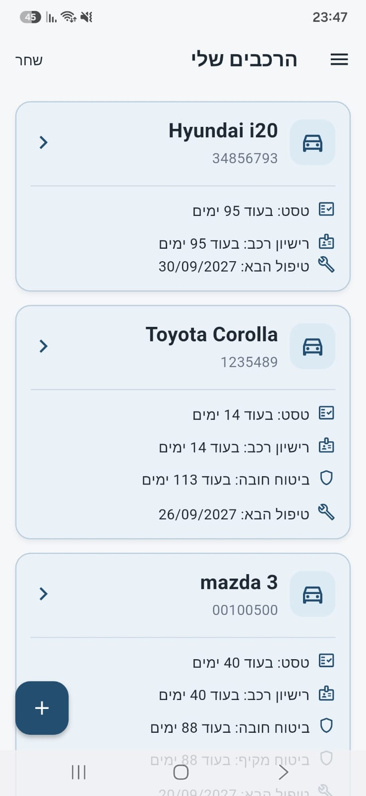
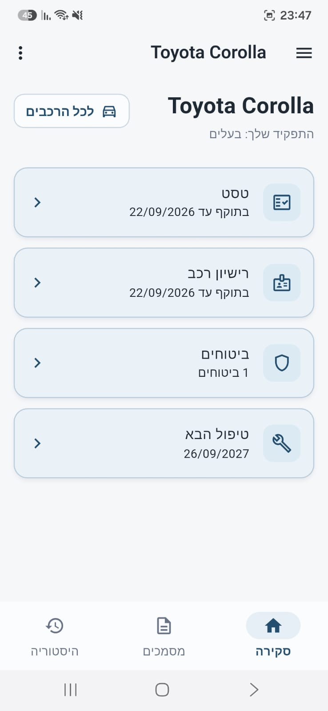
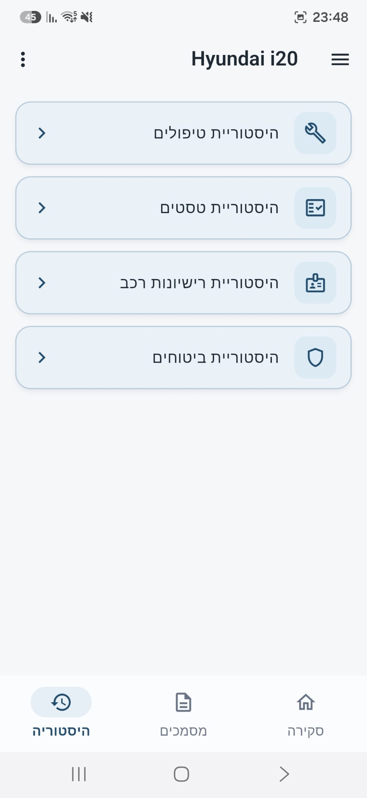
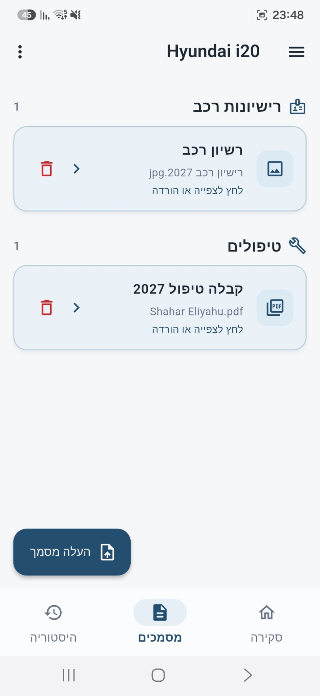

# CarKeep

CarKeep is a Flutter application for managing the complete lifecycle of one or more vehicles in a shared digital space.

The goal is to keep vehicle information, maintenance history, insurance, annual tests, licenses, documents, and shared access all in one organized place.

## Demo

https://github.com/user-attachments/assets/e3a46d70-68e0-4329-8b78-6daa60774a88

## Features

### Vehicle Management

Users can create and manage multiple vehicles with information such as:

- License plate number
- Manufacturer
- Model
- Year
- Current mileage

Each vehicle has its own digital record containing current information, history, documents, and shared users.

### Vehicle Overview

Important vehicle information is displayed through the vehicle overview and home screen:

- Annual vehicle test expiry
- Vehicle license expiry
- Insurance expiry
- Service information

Each section can be individually shown or hidden.

### Vehicle History

CarKeep maintains a history of important vehicle events:

- Services
- Annual tests
- Vehicle license renewals
- Insurance renewals
- Repairs
- Other events

The current vehicle state is calculated from its history. For example, if the latest vehicle license renewal is deleted, CarKeep automatically restores the previous renewal as the current one.

### Documents

Vehicle documents are organized into categories:

- Vehicle licenses
- Annual tests
- Insurance
- Services
- Other documents

Documents can also be uploaded directly while adding a vehicle event. In that case, CarKeep automatically links the document to the event and generates an appropriate document name.

Documents are stored using Supabase Storage.

### Shared Vehicle Access

A vehicle can be shared between multiple users. CarKeep supports three roles:

| Role   | View | Edit Vehicle Data | Manage Events & Documents | Manage Members | Delete Vehicle |
|--------|:----:|:------------------:|:--------------------------:|:---------------:|:---------------:|
| Owner  | ✅   | ✅                  | ✅                          | ✅               | ✅               |
| Admin  | ✅   | ✅                  | ✅                          | ❌               | ❌               |
| Member | ✅   | ❌                  | ❌                          | ❌               | ❌               |

Each vehicle has one owner. The owner can:

- Add and remove users
- Change user roles
- Promote members to admins
- Transfer vehicle ownership

### Service Tracking

CarKeep tracks services using both date and mileage. For example:

```text
Last service: 60,000 km
Service interval: 15,000 km
Next service: 75,000 km
```

It also calculates the next expected service date.

### Account Management

Users can:

- Register and log in
- Update their name
- Change their password
- Sign out
- Delete their account

Account deletion also takes shared vehicle ownership into account — a user who owns a shared vehicle must transfer ownership before deleting the account.

## Screenshots

### Vehicle Management

View multiple vehicles and their key information directly from the home screen.

<p align="center">
  
</p>

### Vehicle Overview

See the vehicle's current license, test, insurance, and service information in one place.

<p align="center">
  
</p>

### Vehicle History

Track previous services, renewals, repairs, and other vehicle events.

<p align="center">
  
</p>

### Documents

Keep vehicle licenses, insurance, service records, and other documents organized by vehicle.

<p align="center">
  
</p>

## Technology Stack

**Frontend**
- Flutter
- Dart
- Material Design

**Backend**
- Supabase
- PostgreSQL
- Supabase Authentication
- Supabase Storage
- Row Level Security
- Edge Functions

## Architecture

The project is divided into separate layers for:

- Models
- Repositories
- Business logic and utilities
- Screens
- Reusable widgets
- Navigation

```text
lib/
├── models/
├── repositories/
├── screens/
├── theme/
├── utils/
├── widgets/
├── app_navigation.dart
└── main.dart
```

Automated unit and widget tests are included for the main application logic and UI flows.

## Current Status

CarKeep is currently under active development. The main application flows are implemented. The current development stage focuses on integration testing with Supabase, including multi-user access, database permissions, Storage permissions, and end-to-end flows.

## Running the Project

Clone the repository:

```bash
git clone https://github.com/Shahar132/CarKeep.git
```

Enter the project:

```bash
cd CarKeep
```

Install dependencies:

```bash
flutter pub get
```

Run the application:

```bash
flutter run
```

## Development and Testing

CarKeep includes unit, widget, and integration tests.

Integration tests run against a local Supabase environment using Docker, allowing authentication, database, Storage, RLS, and Edge Function flows to be tested without modifying the hosted database.

For the complete local development and integration-testing setup, see [CONTRIBUTING.md](CONTRIBUTING.md).

## Platforms

CarKeep is built with Flutter and targets:

- Android
- iOS
- Web

## Author

Developed by Shahar Eliyahu
